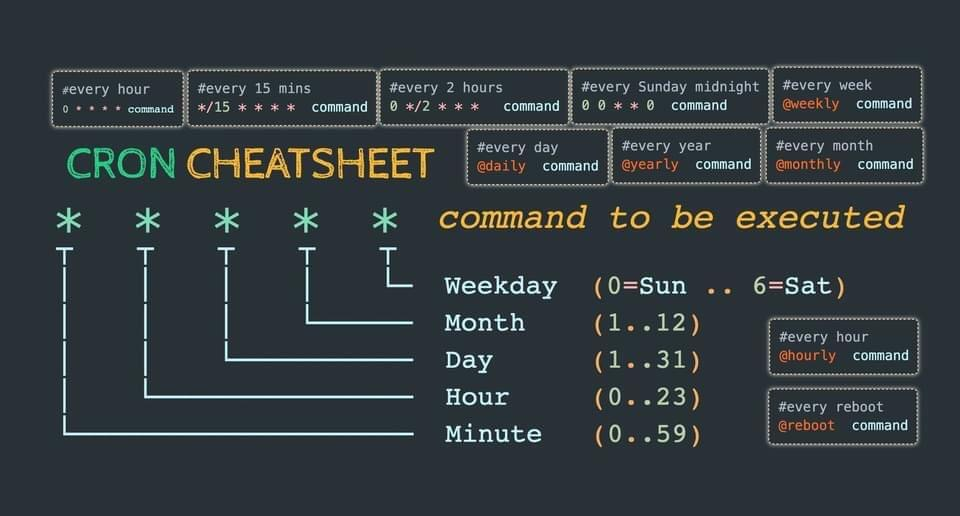
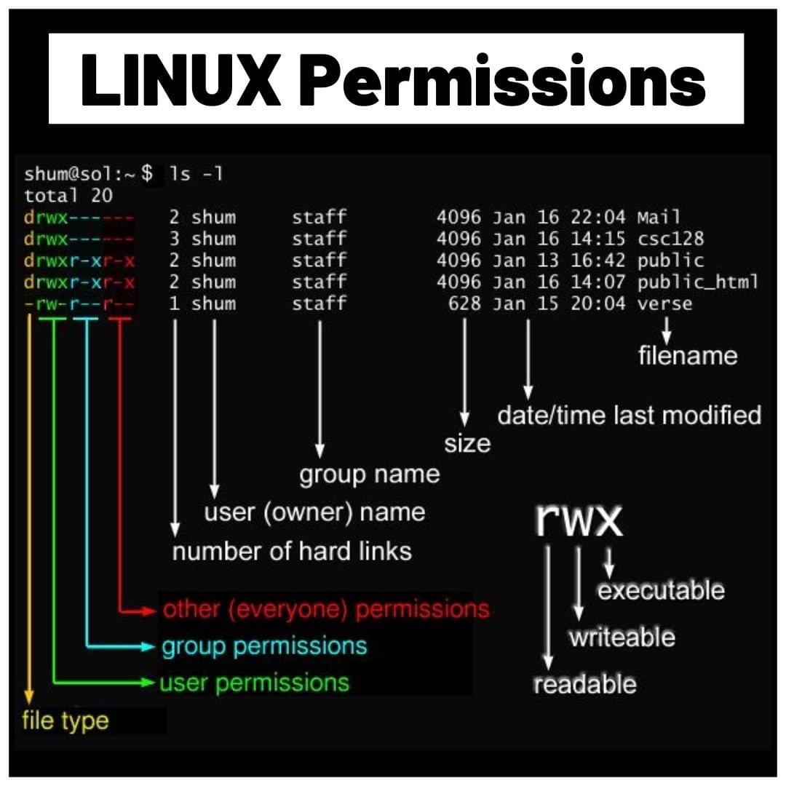
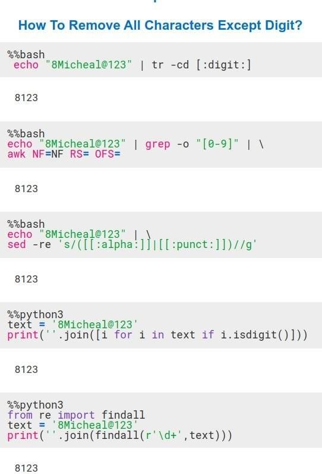
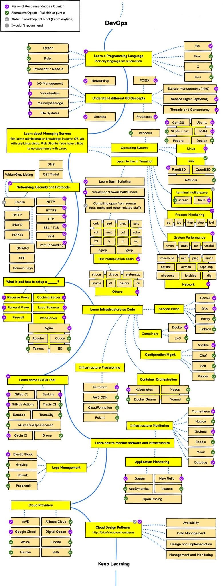

How-To - Various Linux Tips
==========================

   

`du Commands <https://www.linuxteck.com/9-basic-du-command-in-linux-with-examples/?fbclid=IwAR3S4I6ac2qp-nlc8q0eO9lUvvXbXxr9Aj-UKwueKuXD-dW32UsyCD-77pc>`_
